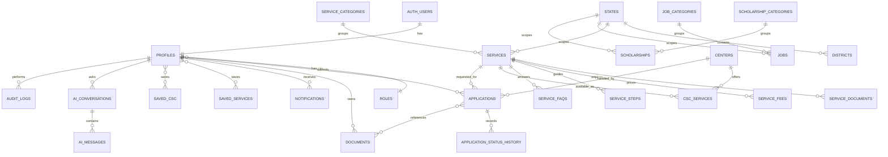

# Citizen Service Platform — Backend ERD

This implementation extends the existing Supabase catalog instead of duplicating it. `profiles` represents `auth.users`; the legacy `centers` table is the canonical CSC directory and is extended by the platform migration.

## Request lifecycle

`submitted → verification → processing → approved → completed`, with `rejected` as a terminal alternative. `application_status_history` is append-only from the application policy perspective and records actor, timestamp, status, and remarks. SQL triggers maintain history and updated timestamps.

## Document boundary

The `documents` table stores metadata only. Files live in the private `private-documents` Supabase Storage bucket under `auth.uid()/uuid-file-name`. Database metadata ownership and storage folder ownership are both enforced. Clients receive short-lived signed URLs rather than public object URLs.
